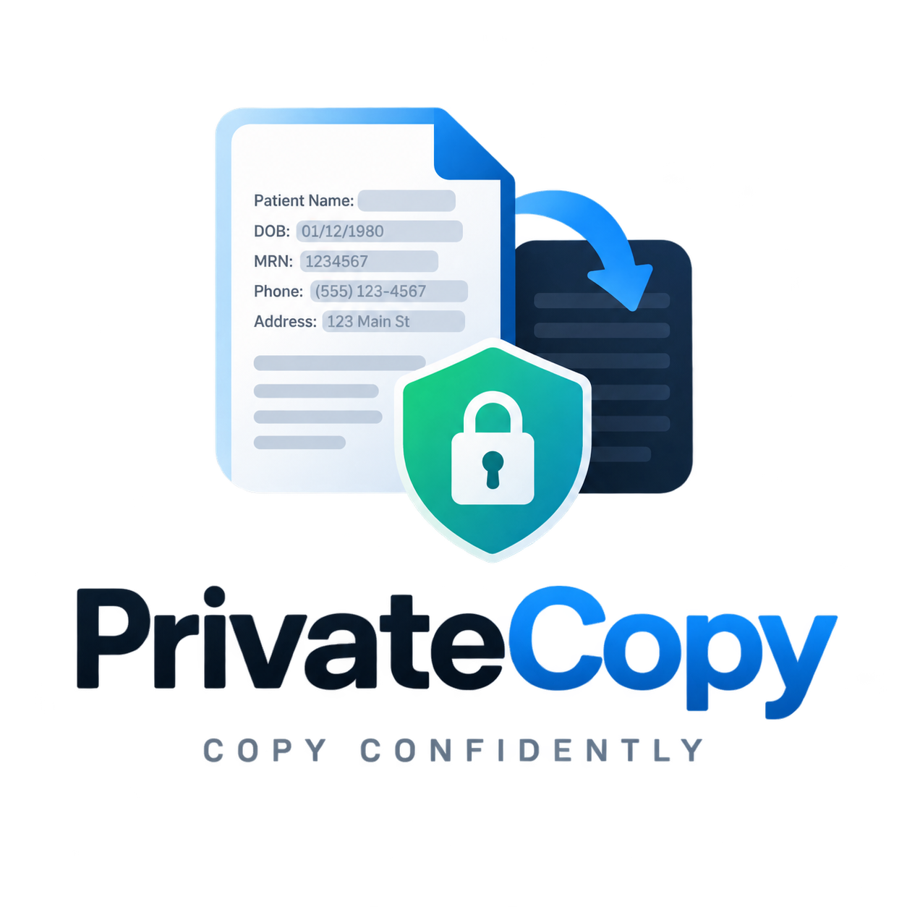

# PrivateCopy



Select text anywhere → press **Ctrl+Shift+C** (Windows/Linux) or **Cmd+Shift+C** (macOS) → PII-redacted text lands back on your clipboard. **100% local, offline after first download.**

> Status: v0.1.0 scaffold. Core pipeline + tray + hotkey + first-run wizard + installers for Win/Mac/Linux.

## How it works

1. First launch asks which model to use (default: **NVIDIA GLiNER-PII**), confirms the hotkey, downloads weights from Hugging Face.
2. Every trigger: read clipboard → truncate at 10k chars → local ONNX inference (threshold 0.5) → replace spans with `[LABEL]` (e.g. `[EMAIL]`) → write back → toast `PrivateCopy: redacted N items`.

## Models (downloaded at runtime, never bundled)

| ID | HF repo | Params | Codecs | License |
|----|---------|--------|--------|---------|
| `nvidia-gliner` (default) | `nvidia/gliner-PII` | ~570M GLiNER | `gliner` + `onnxruntime` | NVIDIA Open Model License — see `THIRD_PARTY_LICENSES/` |
| `openmed-44m` | `OpenMed/OpenMed-PII-SuperClinical-Small-44M-v1` | 44M DeBERTa-v3-small | `optimum[onnx]` + `onnxruntime` | Apache-2.0 |

Why not llama.cpp: both are encoder-only NER models (token-classification / GLiNER span classifier). The local engine is **ONNX Runtime** (CPU default, CUDA/DirectML/CoreML if present), with INT8 quantized exports.

## Quick start (dev)

```bash
python3.11 -m venv .venv && source .venv/bin/activate
pip install -e ".[all,dev]"
python -m privatecopy first-run     # pick model, confirm hotkey, download
python -m privatecopy run-once --text "Contact john.smith@email.com"
python -m privatecopy daemon        # tray + hotkey
pytest
```

## Installers

* Windows: `installer/win/innosetup.iss` → Inno Setup EXE (asks hotkey, Keep/Remap).
* macOS: `installer/mac/` → signed + notarized DMG (`notarize.sh`, needs Apple Developer ID).
* Linux: `installer/linux/build_linux.sh` → `.deb` / `.rpm` / AppImage.
* Updates: GitHub Releases + `latest.json`, checked by `privatecopy/updater.py` (Sparkle on Mac, WinSparkle/bootstrap on Win, AppImage update-info + apt/dnf on Linux).

## Privacy

Fully offline after model download. No telemetry. Original text never written to disk or network — only entity counts + timings in local log. See `docs/PRIVACY.md`.

## Layout

* `privatecopy/` — core package (config, redact, models, clipboard, hotkey, tray, service, updater, cli, first_run).
* `native/` — thin OS shims (macOS NSServices, Windows registry verb, Nautilus/Nemo/Dolphin actions).
* `installer/` — per-OS packaging.
* `scripts/` — `download_models.py`, `export_onnx.py` (build-time helpers).
